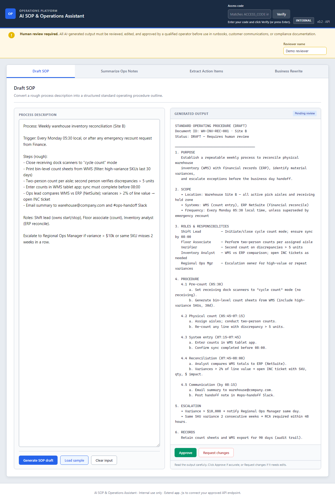
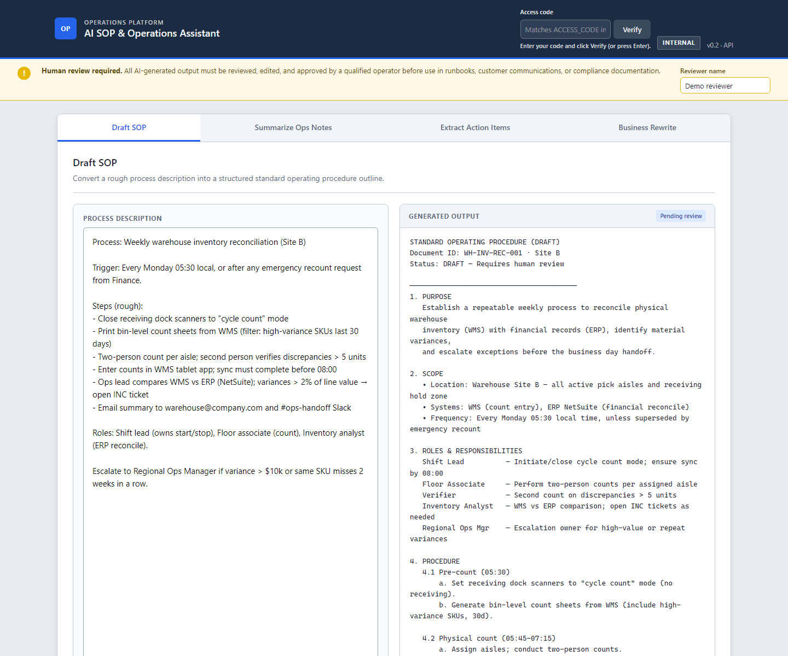

# AI SOP & Operations Assistant

Portfolio prototype for operations teams: draft SOPs, summarize shift notes, extract action items, and rewrite technical updates for business audiences. The UI is a single-page enterprise-style app; **AI runs only through a local Express backend** so your Gemini API key never ships to the browser.





## Features

| Area | What you get |
|------|----------------|
| **Four tools** | Draft SOP · Summarize Ops Notes · Extract Action Items · Business Rewrite |
| **Offline demo** | **Load sample** fills realistic input/output from `samples.js` (no API) |
| **Live AI** | **Generate** on custom text → `POST /api/generate` → Gemini (server-side) |
| **Access gate** | **Verify** checks `ACCESS_CODE` from `.env` before generation |
| **Human review** | Approve · Request changes · Edit output · Reset review (localStorage) |
| **Abuse controls** | Rate limit, daily cap, max input/output tokens (see `.env.example`) |

## Why the API key stays server-side

`GEMINI_API_KEY` bills your Google account. If it lives in `app.js` or static hosting, anyone can copy it from DevTools and spend your quota. This project keeps the key in **`.env`** and uses it only in **`server/gemini.js`**. The browser sends `toolId`, `input`, `accessCode`, and optional `reviewerName` — never the Gemini key.

---

## Prerequisites

- [Node.js](https://nodejs.org/) **18+**
- [Gemini API key](https://aistudio.google.com/apikey)

---

## Local setup

```powershell
cd path\to\ai-sop-operations-assistant
npm install
copy .env.example .env
```

Edit **`.env`** (save the file, then restart the server):

```env
GEMINI_API_KEY=your_key_from_google_ai_studio
ACCESS_CODE=your-shared-passphrase
GEMINI_MODEL=gemini-2.0-flash
```

If you hit **quota errors** on `gemini-2.0-flash`, try `gemini-2.0-flash-lite` in `.env` and restart. Check usage at [ai.dev/rate-limit](https://ai.dev/rate-limit).

**Start the server:**

```powershell
npm start
```

**Dev mode (auto-restart on file changes):**

```powershell
npm run dev
```

Open **http://localhost:3000** (not `file://`). You should see:

- `Loaded environment from .env`
- `ACCESS_CODE loaded (N characters)`
- No placeholder warning for `GEMINI_API_KEY`

Optional: **http://localhost:3000/api/health** → `{ "ok": true, ... }` when env is configured.

---

## Using the app

1. Enter **Access code** in the header (same as `ACCESS_CODE` in `.env`).
2. Click **Verify** (or press **Enter**) until the status shows **Access code verified**.
3. **Load sample** — instant demo, no Gemini call.
4. **Generate** with your own text — calls the backend (requires verify + valid API quota).

| Action | Verify required? | Calls Gemini? |
|--------|------------------|---------------|
| Load sample | No | No |
| Generate (exact bundled sample input) | No | No |
| Generate (custom input) | Yes | Yes |

---

## Verified local integration test

Run with `npm start` and a configured `.env`:

| Step | Endpoint | Expected |
|------|----------|----------|
| Health | `GET /api/health` | `ok: true` when key + access code are set |
| Verify | `POST /api/verify-access` | **200** `{ "ok": true }` with correct code |
| Generate | `POST /api/generate` | **200** `{ "text": "..." }` when quota allows; otherwise **429** `GEMINI_QUOTA` with a clear message |

Example generate body:

```json
{
  "toolId": "summarize-notes",
  "input": "Shift 16 May: conveyor delay 12 min, 5 orders rerouted.",
  "accessCode": "your-access-code",
  "reviewerName": "Demo reviewer"
}
```

Headers: `Content-Type: application/json`, `X-Access-Code: your-access-code`

---

## API reference

### `GET /api/health`

Public config check (no secrets).

### `POST /api/verify-access`

Confirms the access code. Body or header: `accessCode` / `X-Access-Code`.

### `POST /api/generate`

Runs the selected tool prompt against Gemini.

| Code | HTTP | Meaning |
|------|------|---------|
| `ACCESS_REQUIRED` / `ACCESS_DENIED` | 401 | Missing or wrong access code |
| `ACCESS_NOT_CONFIGURED` | 503 | `ACCESS_CODE` missing in `.env` |
| `API_KEY_MISSING` / `API_KEY_INVALID` | 503 | Gemini key missing or rejected |
| `GEMINI_QUOTA` | 429 | Google free-tier / rate limit (wait or change model) |
| `RATE_LIMIT` / `DAILY_LIMIT` | 429 | Server abuse limits |
| `VALIDATION_ERROR` | 400 | Bad `toolId`, empty input, or input too long |
| `GENERATION_FAILED` | 500 | Unexpected server/Gemini error |

---

## Project structure

| Path | Purpose |
|------|---------|
| `index.html`, `style.css`, `app.js`, `samples.js` | Frontend UI + offline samples |
| `server.js` | Express: static files + API routes |
| `server/env.js` | Load `.env`, startup checks |
| `server/security.js` | Access code, rate limiting |
| `server/validate.js` | Request validation |
| `server/dailyCap.js` | In-memory daily cap per IP |
| `server/prompts.js` | Per-tool prompt templates |
| `server/gemini.js` | Gemini client (**API key here only**) |
| `docs/screenshots/` | README screenshots |
| `.env.example` | Environment template |

---

## Regenerating screenshots (optional)

With the server running on port 3000:

```powershell
npx playwright screenshot http://localhost:3000 docs/screenshots/app-home.png --full-page
npx playwright screenshot http://localhost:3000 docs/screenshots/access-and-review.png --viewport-size=1440,1200
```

---

## License

Use and modify for your portfolio as you like.
